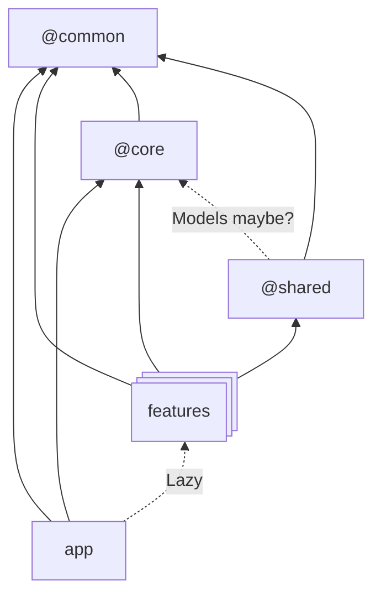

# NgPlayground

This project is a template for futur developments.

## Solution structure



### @common
Reusable components, pipes, directives, services, classes or functions that are business agnostic. Basically those entities can be used in other projects.

### @core
- Components that are visible almost everywhere like header, footer or menu.
- App settings (json file loaded when app starts)
- Security concerns
  - Guards
  - Interceptor
- Api services and models (generated from OAS)
- Error management and error components (page and/or modal)

### @shared
Reusable components, pipes, directives,... that are shared between **features**. Then reusable components with business value.

## Create a sub package in @common ore @core

```bash
mkdir projects/{}/{sub_package}
mkdir projects/{package_name}/{sub_package}/src
echo "export * from \"./public_api.ts\"" > projects/{package_name}/{sub_package}/src/index.ts
echo {} > project/{package_name}/{sub_package}/ng-package.json
```

The file `public_api.ts` contains all exports that are exposed by the sub-package
