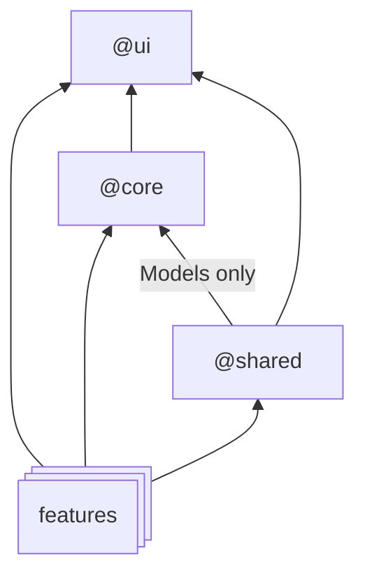

# NgPlayground

This project is a template for futur developments.

## Solution structure

### Dependencies graph

```mermaid
flowchart BT
    ui["@ui"]
    core["@core"]
    shared["@shared"]
    feature@{ shape: procs, label: "features"}
    feature --> ui
    feature --> core
    feature --> shared
    core --> ui
    shared --> ui
    shared -- Models only --> core
```
