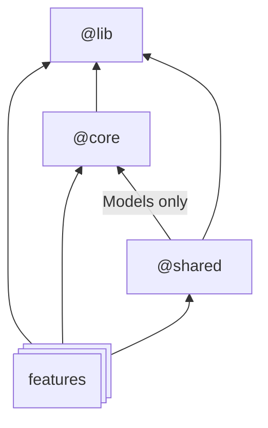

# NgPlayground

This project is a template for futur developments.

## Solution structure

### @lib
Reusable components, pipes, directives, services, classes or functions that are business agnostic. Basically those entities can be used in other projects.

### @core
- Components that are visible almost everywhere like header, footer or menu.
- App settings (json file loaded when app starts)
- Security concerns
  - Guards
  - Interceptor
- Api services and models (generated from OAS)
- Error management and error components (page and/or modal)

### @shared
Reusable components, pipes, directives,... that are shared between **features**. Then reusable components with business value.
